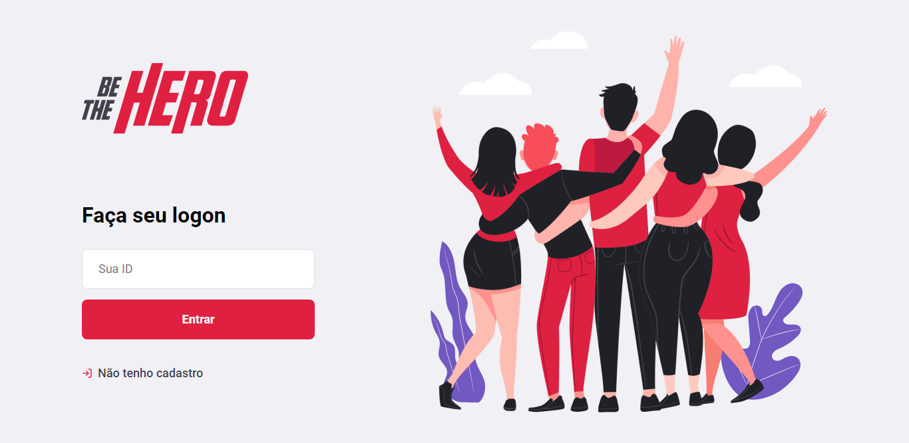

<h1 align="center">
  
</h1>

<h3 align="center">
  React ⚛️ web user interface.
</h3>

<h4 align="center">
  Developed during week OmniStack 11.0 🚀
</h4>

 

  

## 🚀 Technologies

This project was developed with the following technologies:

- [React](https://reactjs.org/)
- [React Router](https://reacttraining.com/react-router/web/)
- [Feather](https://feathericons.com/)
- [Axios](https://github.com/axios/axios)

## 💻 Project

Be The Hero is a project that helps connect NGO's that need help with real heroes who want to contribute to a noble social cause.

## 🤔 How to contribute?

- 🍴 Fork this repo!
- **HACK AWAY** 🔨
- 🔃 Create a new pull request!

## 📝 License

This project is under license from MIT. See the [LICENSE](LICENSE.md) for more details.

---

Developed by Johnny Araújo 👋 [Connect on LinkedIn!](https://www.linkedin.com/in/ijohnnysa/)
